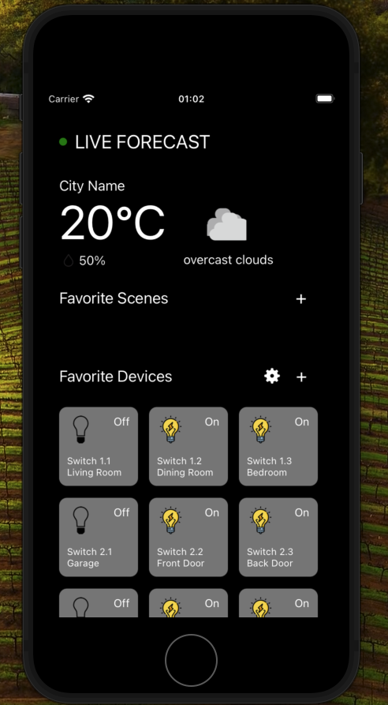

  <h1>SMART HOME DASHBOARD</h1>
  
<b>React Native - TypeScript - iOS Mock Up Project</b>

## App Screenshot

  

## About the Project
* This is a quick frontend mock-up iOS Project built using React Native & TypeScript for a Smart Home Dashboard.
* The main purpose of this app is to showcase clean and structured React Native real-life app development.
* While the app itself does not have additional functionalities beyond displaying this information, it is capable of accepting and passing data to populate the card section dynamically i.e: able to renders multiple instances of the component, each populated with data obtained from dataMockUp.ts via props.

## Viewing the App
To view the app, you will need to have Node.js version 16+ installed, along with CodeX and Metro set up.
1. **Clone the GitHub repo:** [https://github.com/ChrisNulis/SmartHomeDashboard](https://github.com/ChrisNulis/SmartHomeDashboard)
2. Install CodeX and Metro on your machine.
3. Run `npx react-native start` to start the Metro server.
4. In another terminal, run `npx react-native start ios-start` to start your iOS emulator. At this point, you should see an iPhone pop up, and you should be able to see the app locally.